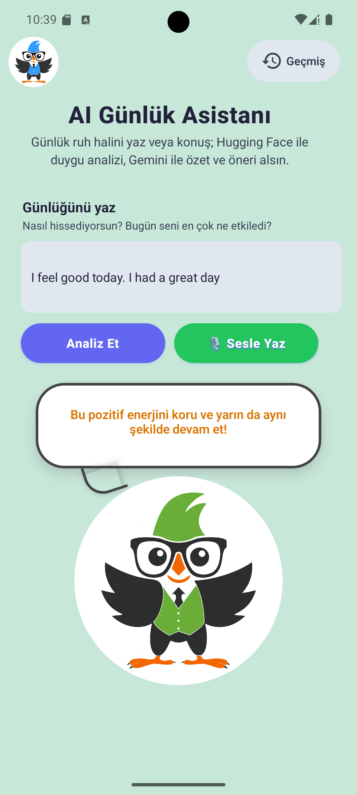
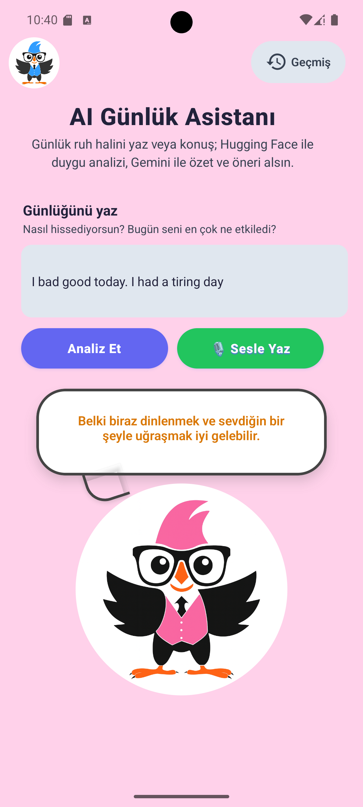

📘 AI Diary Assistant — React Native CLI

An AI-powered emotional journal app built with React Native CLI, Redux Toolkit, Hugging Face, Gemini, and AssemblyAI — all using free-tier APIs.

The app allows users to write or speak about their day, analyzes the emotional tone using AI, generates a short summary + advice, and stores everything locally for offline access.

▶️ Demo Video (YouTube)

Watch the full demo here:

👉 https://www.youtube.com/watch?v=kSHEdsAo2Do

🚀 Features
📝 1. Daily Entry & Emotion Analysis

Users write a sentence (e.g., “I feel tired but hopeful today”) or record audio.
The app performs:

Sentiment Analysis → Hugging Face (distilbert-base-uncased, free endpoint)

Summary Generation → Gemini (free API tier)

Advice Generation → Gemini (free API tier)

Speech-to-Text → AssemblyAI (free tier upload + transcription)

📚 2. Local History (Offline Support)

All analyzed entries are stored in AsyncStorage, so users can view their emotional history even when offline.

🎨 3. Dynamic UI

Background color changes based on detected mood

Animated result bubble (typing animation)

Clean minimal UI

Light animations via React Native Animated API

🔧 4. Free AI Services

All AI interactions use free-tier services:
| Purpose            | Service      | Model / API                                     |
| ------------------ | ------------ | ----------------------------------------------- |
| Sentiment Analysis | Hugging Face | distilbert-base-uncased-finetuned-sst-2-english |
| Summary + Advice   | Gemini API   | gemini-2.0-flash                                |
| Speech-to-Text     | AssemblyAI   | Free transcription endpoint                     |

🛠️ Tech Stack
| Category         | Technology                                               |
| ---------------- | -------------------------------------------------------- |
| Mobile           | React Native CLI (JavaScript)                            |
| State Management | Redux Toolkit                                            |
| UI               | Custom styling (+ small design help from GitHub Copilot) |
| AI               | Hugging Face, Gemini, AssemblyAI                         |
| Local Storage    | AsyncStorage                                             |
| Audio Recording  | expo-av                                                  |
| File Upload      | expo-file-system                                         |
| Animations       | React Native Animated API                                |

📱 Screenshots
🟦 Home Screen

🟩 Analysis Result

🟧 History Screen

📡 API Usage
🔹 Hugging Face — Sentiment Analysis

Used to detect: positive / negative / neutral.
Free model endpoint:
distilbert-base-uncased-finetuned-sst-2-english
🔹 Gemini — Summary & Advice

Generates:

1–2 sentence emotional summary

Personalized advice

Using gemini-2.0-flash (free tier).

🔹 AssemblyAI — Speech to Text

Audio → Upload

Upload → Transcription

100% free-tier compatible
📦 Installation & Setup
1️⃣ Clone the repository
git clone https://github.com/seyitogluhalit/ai-diary-assistant.git
cd myApp

2️⃣ Install dependencies
npm install

3️⃣ Add API Keys
Create an .env or put keys inside config (free-tier only):
HUGGINGFACE_API_KEY=your_key
ASSEMBLYAI_API_KEY=your_key
GEMINI_API_KEY=your_key

4️⃣ Run on Android
npx react-native run-android

5️⃣ Run Metro Bundler
npm start  || npx expo start

🧪 Offline Support

All entries are cached using AsyncStorage

Users can view history without internet

AI features require internet (analysis only)

🧩 Code Assistance Transparency

As required by project rules:

Some UI styling, tiny CSS refinements were assisted by GitHub Copilot.

Small layout inspirations were taken from older React Native sample projects the author previously worked on.

All core logic — Redux, API integration, storage, animations — was manually implemented.

📄 License

MIT License — free to use and modify.

🙌 Author

Developed by Onur — AI-enhanced mobile developer.
